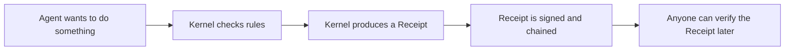

# What is Uniclaw?

> A short, plain-English introduction. After reading this, you should know **what Uniclaw is**, **what it does**, **who it's for**, and **why it's different**.

## In one sentence

**Uniclaw is an AI agent runtime that makes every action it takes provable, so that anyone — not just the operator — can verify what the agent did.**

## The problem Uniclaw solves

AI agents are powerful. They can read your files, send messages, run code, and call APIs on your behalf. But today's agents have a serious gap: **you can't really prove what they did.**

Imagine you let an AI assistant manage some of your work. Later, something goes wrong: a wrong file is sent, a payment is made, a customer is told something incorrect.

You ask: *"What exactly happened? Who approved it? Why did the agent do that?"*

In most agent systems today, the answer is buried in a mix of logs, model outputs, and tool calls. There is no single trustworthy record. Worse, those logs live on the same machine that ran the agent — so a compromised system could quietly rewrite them.

This is fine for a personal toy. It is **not fine** for:

- A bank using an AI to handle support tickets.
- A hospital using an AI to triage records.
- A journalist using an AI to redact sources.
- A government using an AI to draft policy.
- A company that has to pass an audit.

These users need a record that **(a)** cannot be quietly edited and **(b)** can be checked by an outsider who does not trust the operator. That record is what Uniclaw produces, and it calls each one a **receipt**.

## What is a "receipt"?

A receipt is a small, signed file. Every time the agent does something — *anything* — Uniclaw produces a receipt that captures:

- **What** the agent tried to do (the action).
- **Why** it was allowed or denied (the rules consulted).
- **When** it happened (a timestamp).
- **Who** signed off (a digital signature).
- **A link** to the receipt that came right before it (a chain).

Every receipt is signed using cryptography (Ed25519). The signature means anyone with the agent's public key can check, alone, whether the receipt is real. No password needed. No special access needed. Just the public key and the receipt.

The chain matters. Each receipt points back to the one before it using a hash. If someone tries to silently delete or edit a receipt later, the chain breaks — and verification will catch it instantly.

The published goal: every receipt will eventually be reachable at a public URL like `https://uniclaw.dev/receipts/<hash>`, so that an auditor on the other side of the world can look at it without trusting anyone in the loop.

## What can you do with Uniclaw?

Today (Phase 1 is complete), you can:

1. **Run an agent kernel** that produces a signed receipt for every action.
2. **Write rules** in a simple human-readable file (`solo-dev.toml` is the example) that say what the agent is allowed to do and what needs your approval.
3. **Set spending limits** on what the agent can use — bytes of network traffic, file writes, LLM tokens, wall-clock time, total uses. The kernel refuses to exceed them.
4. **Approve risky actions** through the approval engine: the agent pauses, asks you, and only proceeds when you say yes.
5. **Verify receipts** with a tiny standalone tool (`uniclaw-verify`) that has no internet access and no database. You can run it on an offline laptop.
6. **Explain receipts** in plain English with `uniclaw-explain` — useful when your auditor wants a human-readable version.
7. **Store receipts** in a chain that refuses any tampered or out-of-order entry.
8. **Run a Light Sleep cleanup pass** that keeps the agent's state tidy and writes a receipt proving the cleanup happened.

What's coming next is on the [roadmap](03-roadmap.md): public-URL hosting, REM Sleep (daily reflection), Deep Sleep (weekly integrity walks), the WASM tool host, the secret broker, and the Android-native mobile profile.

## Who is Uniclaw for?

Uniclaw is **not trying to be the agent for everyone**. It is built specifically for users who care about **proof** more than they care about convenience. In rough priority order:

| Audience | Why they need Uniclaw |
|---|---|
| **Compliance-bound enterprises** (finance, healthcare, legal, government) | They have to pass SOC2 audits and the EU AI Act. Receipts are exactly what auditors want. |
| **Multi-user teams that distrust any single operator** | One person should not be able to silently change the history of what the agent did. |
| **Mobile-first users** who want privacy | Uniclaw plans an Android-native profile where the model runs *on your phone*, with the phone's secure hardware verifying sensor inputs. |
| **Policy authors and security engineers** | Rules live in a separate, reviewable file — not buried in prompts. Easy to test. |
| **Journalists and source-protection workflows** | Redactions become provable: "this part was hidden, here is the proof, the rest of the receipt is intact." |
| **Vendors selling AI to regulated industries** | Customers can verify your agent's behavior **without** access to your servers. |

If you just want a chatbot, Uniclaw is overkill. If you need to prove what your agent did to a person who does not trust you, Uniclaw is the point.

## What can Uniclaw do? (skills)

This is the short list of "skills" that make Uniclaw different from other agent runtimes:

1. **Verifiable receipts**. Every action becomes a signed, chain-linked record.
2. **Cold verification**. Anyone with the public key can check a receipt — no service to call, no API to trust.
3. **Constitution engine**. Rules are written in TOML, separate from the model, and tested like normal code.
4. **Capability budgets**. Hard, numerical limits on what an action can consume. Algebraic — limits compose when one tool delegates to another.
5. **Approval engine**. Risky actions stop, ask the operator, and only continue if approved. The approval itself is recorded as a receipt.
6. **Sleep-stage memory**. The agent runs background passes (Light, REM, Deep) to keep memory consolidated. Each pass writes its own receipt.
7. **Explainability**. A second tool turns receipts into plain-English explanations for non-technical readers.
8. **Mobile-sovereign profile** (planned). The whole runtime fits on an Android phone, with hardware attestation for sensor inputs.

## How do you use Uniclaw?

Uniclaw is **early**. Today you:

- Clone the repo from `https://github.com/UniClaw-Lab/uniclaw`.
- Run `cargo build --workspace`.
- Use the libraries (`uniclaw-kernel`, `uniclaw-store`, `uniclaw-constitution`, …) from a Rust program.
- Use the standalone binaries `uniclaw-verify` and `uniclaw-explain` from the command line.

Soon (Phase 2):

- Public-URL receipt hosting at `uniclaw.dev`. You'll be able to share a URL with an auditor and they will verify it in their browser, with no Uniclaw account needed.

Later (Phase 5+):

- Android app. Full mobile-sovereign mode.

## Why "Uniclaw"?

There is a small family of "claw" projects in the AI agent space (OpenClaw, ZeroClaw, NanoClaw, OpenFang, NemoClaw, PicoClaw, NullClaw, IronClaw, LocalClaw — nine in total). They all approach AI agents differently. **Uniclaw** is the one that picked **verifiability** as its central promise. The name signals "one consistent claw" with a single, focused thing it tries to be best at: **proof you can actually use**.

For a head-to-head with the most popular of those projects, see [Uniclaw vs OpenClaw](02-uniclaw-vs-openclaw.md).

## What Uniclaw is NOT

Equally important — these are things Uniclaw deliberately does **not** try to be:

- **Not the smallest agent.** NullClaw (in Zig) wins that fight at 678 KB.
- **Not the most channels.** OpenClaw owns Slack/Discord/Teams/etc.
- **Not the most edge-firmware-ready.** ZeroClaw and PicoClaw are more focused there.
- **Not enterprise NVIDIA-stack.** NemoClaw fills that niche.

Trying to win on every axis is how a project ends up doing nothing well. Uniclaw stays narrow on purpose.

## In summary

Uniclaw is an AI agent runtime designed for people who need to **prove** what their agent did. It does this by turning every action into a signed, chained, cold-verifiable receipt — and by structuring the runtime around a tiny trusted core that produces those receipts honestly. Today it is a Rust workspace with 10 small crates you can use as a library. Soon it will be a public service you can curl. Later it will be an Android app on your phone.

If you want to see how each piece works, the [Phase 1 step docs](steps/) explain each crate one at a time, in plain English.
