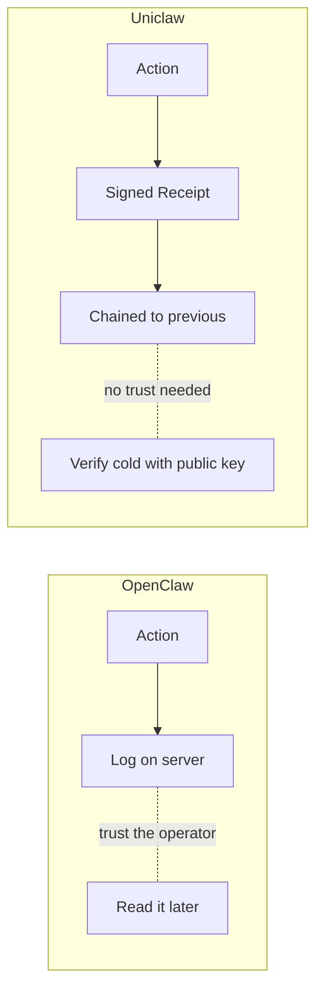

# Uniclaw vs OpenClaw

> A side-by-side comparison in plain English. If you already use OpenClaw or are choosing between the two, this is the page for you.

## The short answer

| | **OpenClaw** | **Uniclaw** |
|---|---|---|
| **Built for** | Many users, many channels, fast setup | Provability and audit trails |
| **Sweet spot** | Personal assistants, hobby projects, small teams | Compliance, multi-user teams, regulated industries |
| **Language** | TypeScript / Node.js | Rust (no_std core, std interfaces) |
| **Trust model** | Trust the operator | Trust **no one** — verify the receipts |
| **Mobile** | Web only | Android-native planned (mobile-sovereign profile) |

If you want **a quick agent that works on Slack tonight**, use OpenClaw.
If you want **a record an auditor will accept**, use Uniclaw.

## What they share

Both projects are honest attempts at building an AI agent runtime. Both provide:

- A way to define **tools** the agent can call.
- A way to define **rules** for what the agent should and should not do.
- A way to **store** memory and conversation history.
- A way to **integrate** with channels (chat platforms, webhooks, etc.).

They are not enemies. They serve different users.

## How they differ

### 1. The trust model

This is the biggest difference and the one that drives everything else.

**OpenClaw assumes you trust the operator.** Logs are kept. Plugins run. The history of what the agent did is visible *if you have access to the server*. If the server is compromised or the operator is untruthful, the history can be silently changed.

**Uniclaw assumes you trust no one.** Every action becomes a signed receipt. The signature is checked using cryptography (Ed25519). Receipts form a chain — each one points back to the one before it. If anyone tries to change or delete a receipt, the chain breaks and verification fails. You don't have to trust the operator; you trust the math.



### 2. Where rules live

In **OpenClaw**, rules tend to live inside prompts and skill manifests. The model itself decides whether to follow them. If the model gets confused or jailbroken, the rules can be sidestepped.

In **Uniclaw**, rules live in a separate **Constitution** file, written in TOML. They are not prompts — they are code-checked rules that the kernel consults *after* the model proposes an action. The model cannot bypass them, even if it tries. If a rule says "shell.exec needs human approval," the agent literally cannot run shell commands without you saying yes.

### 3. Spending limits

**OpenClaw** does not have a strong, kernel-level spending limit system. You can add limits in tool code or in middleware, but they are not algebraic — meaning if Tool A delegates to Tool B, the budget may not flow correctly between them.

**Uniclaw** has **capability budgets** with **algebra**: budgets compose. When Tool A delegates to Tool B with a smaller budget, Tool A's remaining budget is reserved upfront so Tool B cannot accidentally exceed Tool A's parent limit. The kernel enforces this. Every charge produces a receipt.

### 4. Approvals

**OpenClaw** can ask for approval, but the approval and the action are not cryptographically tied together.

**Uniclaw** treats every approval as a first-class event. When a rule says "this needs approval," the kernel produces a *Pending* receipt and waits. When the operator answers (yes or no), the kernel produces a final receipt that points back to the Pending one through a provenance edge. An auditor can see the whole story: "the agent wanted X → it asked for approval → the operator said yes (or no) → the action was (or was not) executed." Forging that chain is impossible without the operator's private key.

### 5. Audit trail

**OpenClaw** uses logs. Logs are good for debugging. They are not good for proving anything to someone who does not trust the system that produced them.

**Uniclaw** uses receipts and a Merkle chain. Each receipt is signed. Each one chains to the one before. The Light Sleep / Deep Sleep system runs scheduled integrity walks across the chain. The eventual goal is to publish receipts at public URLs (`https://uniclaw.dev/receipts/<hash>`) so an auditor can verify them in a browser without an account.

### 6. Mobile

**OpenClaw** has a web UI. There is no first-class Android client.

**Uniclaw** has a **mobile-sovereign profile** on the roadmap (Phase 5+): an Android-native operator app where the **model runs on the phone**, sensor inputs are **hardware-attested** by the phone's secure enclave, and you can use the agent fully offline if your phone has the GPU/NPU for it. This is something no other claw is targeting.

### 7. Size

**OpenClaw** is a Node.js / TypeScript project with a typical Node-sized footprint.

**Uniclaw** is Rust with strict size discipline (master plan §24.2). Each kernel file stays under 5,000 lines of code. The cold-verifier binary (`uniclaw-verify`) is **722 KB** stripped — small enough to run on a Raspberry Pi or a phone. The model runtime profile targets edge hardware as a first-class case.

### 8. Number of crates / modules

**OpenClaw** is a single big project organized as one Node package (with sub-packages).

**Uniclaw** is currently 10 small Rust crates, with a hard ceiling at 20 (master plan §24.2). Each crate has one job. Each crate stays small. This is deliberate: a small kernel is easier to audit, easier to formalize, easier to trust.

```
uniclaw-receipt        Receipt format
uniclaw-verify         Standalone cold verifier
uniclaw-kernel         Trusted runtime core
uniclaw-constitution   Rules engine
uniclaw-budget         Capability budgets
uniclaw-approval       Approval decisions
uniclaw-explain        Receipt explainer
uniclaw-router         Approval routers
uniclaw-store          Receipt log storage
uniclaw-sleep          Sleep-stage cleanup
```

## A quick example: the same task in both

Suppose the user types: *"Run `rm -rf old_logs/`."*

**OpenClaw**, simplified:

1. The model decides whether to call the shell tool.
2. If yes, it calls `shell.exec("rm -rf old_logs/")`.
3. A log entry is written.
4. If you trust the server, you can read the log.

**Uniclaw**, simplified:

1. The model proposes an action: `Action { kind: "shell.exec", target: "rm -rf old_logs/" }`.
2. The Constitution engine checks: there's a rule that says "shell.exec requires approval."
3. The kernel produces a **Pending** receipt, signed.
4. The approval router (CLI, in v0) shows you the pending receipt and asks for `approve` / `deny`.
5. You type `approve`.
6. The kernel re-checks the budget (network bytes, file writes, etc.).
7. The kernel produces a final **Approved** receipt with a provenance edge pointing back to the Pending one.
8. Both receipts are stored in a chain. Both are individually verifiable with the public key alone.

The Uniclaw flow has more steps. That is the point. Each step produces evidence.

## When to pick which

Pick **OpenClaw** when:

- You want to ship something *this weekend*.
- You are the only person who needs to trust it.
- Rich channel integration (Slack, Discord, etc.) matters more than audit.
- You are comfortable with TypeScript.

Pick **Uniclaw** when:

- An auditor or regulator will look at what your agent did.
- More than one person needs to trust the record (e.g., a team).
- A user, an operator, and a third party all need a shared, verifiable history.
- You are comfortable with Rust, or are willing to use Uniclaw as a service.
- You want to run an agent on a phone with privacy guarantees.

## The honest disclaimer

Uniclaw is **early**. As of today, Phase 1 (the verifiable core) is complete; Phase 2 (public-URL receipt hosting) is starting. OpenClaw is **mature** and has been used in production for some time.

If you need an agent in production today, OpenClaw is the safer pick. If you can wait — or if you can use Uniclaw's libraries while we finish the public service — Uniclaw will give you something OpenClaw cannot: a record that survives even when nobody trusts the operator.

That is the whole pitch.
