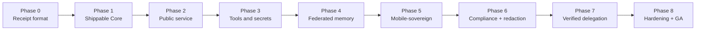

# The Uniclaw Roadmap (8 phases, plain English)

> A guided tour through the receipt-first roadmap. Each phase is one focused goal. We finish a phase before moving to the next.

The full plan lives in `UNICLAW_PLAN.md` §28. This page is the friendly summary.

## Why "receipt-first"?

The order matters. Many AI agent projects build the agent first and bolt on logging afterward. Uniclaw goes the other way. The **first thing** we built was the receipt format. **Then** we built the runtime around it. Why?

Because if the receipt format is wrong, every later piece is built on sand. By making receipts come first, every later step has to *fit* the receipt format — which keeps the whole runtime honest.



## Phase 0 — Receipt-First Foundation ✅ done

**Goal:** define what a receipt looks like, how to sign it, and how to verify it cold.

**What shipped:**

- `RFCS/0001-receipt-format.md` — the human-readable spec for what a receipt is.
- `uniclaw-receipt` crate — Rust types for receipts, plus crypto sign/verify behind a feature flag.
- `uniclaw-verify` — a tiny standalone binary (~720 KB stripped) that takes a receipt JSON file and reports whether it verifies. Has no internet, no database, no dependencies on anything else.

**Why it matters:** before this phase, "verifiable" was a promise. After this phase, you can hand someone a JSON file and a public key, and they can verify it on an offline laptop.

→ See [steps/00-foundation-receipts.md](steps/00-foundation-receipts.md).

## Phase 1 — Shippable Core ✅ done (you are here, just finished)

**Goal:** build the trusted runtime core that produces receipts honestly.

This is the longest phase because it lays in everything the kernel needs: state machine, rules, budgets, approvals, storage, sleep cleanup. It shipped in 8 steps:

1. **Kernel state machine sketch** — the core that turns proposals into receipts.
2. **Constitution engine** — code-based rules separate from the model.
3. **Capability budgets** — algebraic spending limits.
4. **Receipt explainer** — turn receipts into plain English.
5. **Approval engine** — Pending receipts and operator response.
6. **Channel-aware approval routing** — how the operator gets asked.
7. **Receipt store** — chain-validated, issuer-pinned storage.
8. **Light Sleep cleanup** — the first sleep-stage memory pass.

After Phase 1: the trusted core is **internally** complete. You can wire it up and run it. What it cannot yet do is **show itself** to the outside world.

→ See [steps/01-kernel-state-machine.md](steps/01-kernel-state-machine.md) through [steps/08-light-sleep.md](steps/08-light-sleep.md) for one page per step.

## Phase 2 — Public Service 🚧 in progress

**Goal:** make receipts publicly verifiable through a URL.

**What's shipping:**

- ✅ **`uniclaw-host` crate** — an HTTP server that serves any receipt at `/receipts/<hash>`. Step 9. See [steps/09-public-url-hosting.md](steps/09-public-url-hosting.md).
- ✅ **SQLite-backed receipt log** — persistent receipts that survive process restarts. Step 10. See [steps/10-sqlite-receipt-store.md](steps/10-sqlite-receipt-store.md).
- ✅ **Deep Sleep integrity walk** — scheduled `verify_chain()` pass that mints a `$kernel/sleep/deep` audit receipt. Step 11. See [steps/11-deep-sleep.md](steps/11-deep-sleep.md).
- ✅ **HTML verifier UI** — `/verify` page with browser-native Ed25519 verification via `crypto.subtle`. Closes the wedge to non-engineer auditors. Step 12. See [steps/12-html-verifier.md](steps/12-html-verifier.md).
- 🔜 A real, running instance at `https://uniclaw.dev/receipts/...`.
- 🔜 REM Sleep (daily reflection) — blocked on Phase 4 provenance graph + memory subsystems.

**Why it matters:** **this is the wedge made tangible.** Every prior step is infrastructure that you have to read source code to appreciate. Phase 2 is when an auditor on the other side of the world can `curl` a URL and verify a receipt.

## Phase 3 — Tools and Secrets 🚧 in progress

**Goal:** let the agent actually do things, safely.

After studying how the four reference Rust/TypeScript claws (IronClaw, OpenFang, ZeroClaw, OpenClaw) shape their tool-execution architecture, Phase 3 is broken into focused steps. Each is small enough to ship, review, and merge cleanly. (Step 16 split into 16a/16b/16c after wasmtime + Component Model proved heavy enough to warrant separate PRs; the original "six steps" target now becomes eight.)

- ✅ **Step 13 — Tool Execution Foundation.** New `uniclaw-tools` crate: `Tool` trait + `Capability` enum (7 variants, glob-aware) + `ApprovalPolicy` + `ToolHost` registry + `NoopTool` builtin. Kernel: `KernelEvent::RecordToolExecution` mirrors the Approval flow. **No WASM runtime yet** — this is the trait foundation. See [steps/13-tool-foundation.md](steps/13-tool-foundation.md).
- ✅ **Step 14 — Native HTTP Fetch Tool with Capability Enforcement.** New `uniclaw-tools-http` crate: `HttpFetchTool` (synchronous GET via `ureq`), capability-allowlist gate, SSRF refusal of private/loopback/link-local/multicast IPs, bounded response, no auto-redirects. Validates the `Capability` enum + trait surface from step 13 against real network code. Adds `Capability::is_granted_by` helper. See [steps/14-http-fetch-tool.md](steps/14-http-fetch-tool.md). **Reordered from the original plan**: this step was supposed to be WASM, but WASM-with-I/O needs capability enforcement, and capability enforcement needs a real consumer to validate against. Native HTTP first → secrets next → WASM with both already proven.
- ✅ **Step 15 — Secret Broker.** New `uniclaw-secrets` crate: `SecretValue` (drop-zeroizing, redacted Debug, no Serialize/Clone), `SecretBroker` trait, `InMemorySecretBroker` and `EnvSecretBroker` reference impls. `HttpFetchTool` gains `with_broker(...)` and `AuthSpec::BearerHeader { secret_ref }` for fail-closed credential injection. `ToolOutput` gains `metadata.secrets_used`; the kernel mints one `secret_used` provenance edge per consumed reference (name only — never value). See [steps/15-secret-broker.md](steps/15-secret-broker.md).
- ✅ **Step 16a — WASM Tool Runtime skeleton.** New `uniclaw-tools-wasm` crate: `WasmTool` wraps a `wasmtime::Module` behind the `Tool` trait, applying three independent resource limits — fuel (CPU), memory cap (heap), epoch deadline (wall-clock) — on every call. `ToolError::Timeout` finally has its first real producer. Core wasm only (no Component Model, no host imports, no Rust→WASM build fixture). See [steps/16-wasm-tool-runtime-skeleton.md](steps/16-wasm-tool-runtime-skeleton.md).
- ✅ **Step 16b — WASM Component Model layer.** New `wit/tool.wit` defining `uniclaw:tool@0.1.0` with a `tool-api.call(list<u8>) -> result<list<u8>, string>` interface; `wasmtime::component::bindgen!` host glue; `WasmTool::from_component_bytes(...)` constructor; a committed `tests/fixtures/echo-component.wasm` Rust→WASM Component (built locally via `cargo-component`; CI loads bytes as-is). `WasmTool` becomes a `WasmKind { Core, Component }` enum internally; `Tool::call` dispatches. `wasmtime-wasi` added to satisfy the WASI imports that std-using Rust→WASM Components automatically declare (linker provides empty WASI ctx — no real capability granted). All 16a tests still pass; 7 new tests for the Component path. See [steps/16b-wasm-component-model.md](steps/16b-wasm-component-model.md).
- ✅ **Step 16c — WASM host imports.** Extended `wit/tool.wit` with a `host` interface (`http-fetch`, `secret-exists`, `log-message`, `now-millis`) plus a `tool-with-host` world that imports `host` and exports `tool-api`. New `WasmTool::from_component_bytes_with_host(...)` constructor takes `Arc<HttpFetchTool>` + `Arc<dyn SecretBroker>`; the guest's `http-fetch` calls delegate to *the same* HttpFetchTool — same capability allowlist, same SSRF gate, same broker-backed Authorization injection. `secret-exists` returns `bool` only — never reveals values. Per-call `secrets_used` accumulates in `HostState` and surfaces in `ToolOutput::metadata.secrets_used`, so the kernel's existing `secret_used` provenance edges (step 15) work for WASM tools by construction. New committed `tests/fixtures/http-tool-component.wasm` fixture exercises every host import end-to-end. 9 new integration tests. See [steps/16c-wasm-host-imports.md](steps/16c-wasm-host-imports.md). **The WASM substrate swap is now complete: WASM tools are first-class peers of native tools.**
- ✅ **Step 18 — Output sanitization / redaction proofs.** New `uniclaw-redact` crate: `Redactor` trait + `RedactionResult` + `PatternRedactor` (regex-based) with default-rule corpus (GitHub PATs/OAuth, OpenAI/Anthropic, Slack ×4, AWS, JWT, Bearer header) + `RedactorStack` for composition. `uniclaw-receipt` gains `RedactionReport` + `RuleMatch` audit-data types. Kernel `ToolExecution.redaction: Option<RedactionReport>` field threads through `handle_record_tool_execution`: when present, the receipt's `output_hash` is the post-redaction form, `body.redactor_stack_hash` is populated (was a placeholder field since RFC-0001), and one `redaction_applied` provenance edge fires per rule with `count > 0`. Backwards-compatible (None field default, existing tests unchanged). 4 new kernel tests + 16 unit tests. PatternRedactor throughput ~500 MiB/s on 64 KiB+ payloads. See [steps/18-output-sanitization.md](steps/18-output-sanitization.md). **Phase 3's wedge is now complete: capability + SSRF + secrets + WASM (core / Component / with-host) + redaction + verifiable receipts for every action.**

## Phase 3.5 — Receipt-format hardening + adoption-foundations

**Goal:** make the receipt format boringly interoperable so verifiers in any language produce byte-identical output, then put the wedge in front of an outside reviewer in one runnable artifact. Per the war analysis (`UNICLAW_CLAW_WAR_ANALYSIS.md`), this is the highest-leverage work for the wedge: *"if verification is not universal, Uniclaw stays a Rust project. If verification is universal, Uniclaw becomes a protocol."* Inserted between Phase 3 and Phase 4 because every Phase 4 receipt type lands on the receipt format — better to canonicalize first, *then* show the result.

- ✅ **Step 19 — Receipt canonicalization (RFC 8785 JCS).** New `canonical` module in `uniclaw-receipt` with a JCS encoder (lexicographic key sort, normalized integers, standard string escapes). `RECEIPT_FORMAT_VERSION` bumped 1 → 2. `Receipt::content_id` / `crypto::sign` / `crypto::verify` dispatch on `body.schema_version`: v1 receipts continue to verify under legacy `serde_json` rules; v2 receipts use JCS. Five test vectors at `crates/uniclaw-receipt/tests/vectors/canonical-v2.json` pin canonical bytes + BLAKE3 hashes. Browser verifier (`uniclaw-host` / `verify.html`) gets a JS port of the canonicalizer; a Node.js conformance smoke (`conformance-smoke.mjs`) proves byte-identity to the Rust output across all 5 vectors. JCS adds ~30 µs/receipt overhead (+572% over serde_json default; absolute ~36 µs/receipt at 22.5 MiB/s — well under any latency budget). RFC-0001 updated with the new section 0 documenting the canonicalization rules. See [steps/19-receipt-canonicalization.md](steps/19-receipt-canonicalization.md).
- ✅ **Step 20 — End-to-end demo.** New `crates/uniclaw-host/examples/end-to-end-demo.rs` (~580 LOC) wires Phase 3's complete stack (kernel + constitution + budget + approval + HTTP fetch tool + secret broker + redactor + canonical receipts) into one runnable artifact. `cargo run --release --example end-to-end-demo -p uniclaw-host` walks 5 representative actions — Allowed, Pending → Approved, Denied, `secret_used` provenance edge, `redaction_applied` provenance edge — and prints 6 verifiable receipt URLs alongside the issuer public key. Spins up `uniclaw-host` serving every receipt at `/receipts/<hash>` plus the browser verifier at `/verify`. A built-in mock HTTP server (~50 LOC) plays the role of the external API; deterministic Ed25519 key (`[42u8; 32]`) keeps the issuer stable across runs. Closes **success threshold 2** (visibility): a third party can run one command, paste any URL into `/verify`, and watch the trust property work cold. See [steps/20-end-to-end-demo.md](steps/20-end-to-end-demo.md).
- ✅ **Step 20a — TypeScript verifier npm package.** New top-level `packages/verifier-ts/` (first JS/TS package — Rust workspace stays at 17 of 20). Ships `@uniclaw/verifier`: ESM-only TypeScript package exporting `verifyReceiptUrl` / `verifyReceiptJson` / `verifyReceipt` / `canonicalizeBody` / `computeContentIdHex`. Two dependencies (`@noble/curves` + `@noble/hashes`, both audited Paul-Miller libraries with no native modules, no postinstall scripts). Includes a tiny CLI (`npx uniclaw-verify-ts <url-or-path>`). 34 vitest tests pass — including 10 cross-language conformance assertions that load the SAME `canonical-v2.json` fixture the Rust snapshot test loads, proving byte-identical canonical bytes and BLAKE3 content_ids across implementations. End-to-end smoke against the step-20 demo binary: 6 of 6 receipts verify under the TS CLI; tamper test (flip the `decision` field) correctly rejected. **Closes success threshold 1 (portability)**: a TypeScript developer can `npm install` a verifier and validate a Uniclaw receipt minted on a Rust kernel — bytes match, on any platform that runs Node 20+ or a modern browser. See [steps/20a-typescript-verifier.md](steps/20a-typescript-verifier.md).
- ✅ **Step 21 — HTTP proposal API.** `uniclaw-host` gains an opt-in proposal/approval surface mounted at `/v1` when started with `--constitution <path>`. Endpoints: `POST /v1/proposals` (mints `evaluate_proposal` receipts) and `POST /v1/approvals/{content_id}/resolve` (mints `resolve_approval` receipts). The kernel + constitution + log run inside the binary; minted receipts are immediately fetchable via the existing `/receipts/<hash>` route. New modules `crates/uniclaw-host/src/{api,signer,clock}.rs` (Ed25519 signer + RFC 3339 `SystemClock`/`StubClock` helpers, both reusable). `uniclaw-kernel`/`uniclaw-constitution`/`uniclaw-approval`/`ed25519-dalek` move from dev-deps to regular deps. 11 new integration tests in `tests/api.rs` (200/400/404/409 + chain-linkage), 5 new clock unit tests. End-to-end cross-language smoke against the live binary: Allowed / Pending / Approved / Denied minted via curl, all 4 verify under `@uniclaw/verifier`; tamper test correctly rejected. HTTP keepalive latency: ~4.2 ms/request (vs ~45 µs direct kernel call). **Ships the threshold-3 lever**: any language that speaks HTTP can now produce verifiable Uniclaw receipts via the local-sidecar pattern from the war analysis — no Rust toolchain, no kernel embedding. No authentication in this PR (warning printed on startup; bind to loopback or a trusted segment). See [steps/21-http-proposal-api.md](steps/21-http-proposal-api.md).
- ✅ **Step 22 — `@uniclaw/client` TypeScript SDK.** New top-level `packages/client-ts/` (second JS/TS package; first was `@uniclaw/verifier`). Rust workspace stays at 17 of 20. Ships `@uniclaw/client`: one class (`UniclawClient`), three operations (`evaluate` / `resolveApproval` / `verifyReceiptUrl`), verify-by-default. The `Decision` is a discriminated union (`allowed | denied | approved | pending`) where `PendingDecision` carries `.approve()` / `.deny()` callbacks. Wraps the step-21 HTTP API + step-20a verifier into a single idiomatic surface; OpenClaw-, NemoClaw-, or any TS-runtime-style integration is now one `npm install` + one `await client.evaluate(action)`. 24 tests pass (17 unit with mocked fetch + 7 integration against a live `uniclaw-host` subprocess, including a tamper test that confirms verify-by-default rejects a mutated receipt). Bench: 0.27 ms client overhead vs raw fetch, 15.6 ms verify overhead (one extra `GET /receipts/<hash>` + JCS/BLAKE3/Ed25519). **First concrete cross-claw adapter ships**: the on-ramp for every non-Rust runtime to anchor agent actions into Uniclaw receipts. See [steps/22-typescript-client.md](steps/22-typescript-client.md).
- ✅ **Step 23 — Tool-execution API.** Adds `POST /v1/tool-executions` to `uniclaw-host` and `client.recordToolExecution(...)` to `@uniclaw/client`. Anchors completed external tool calls into the chain with the kernel's `$kernel/tool/executed` receipt class. One endpoint covers three war-analysis semantics: optional `secrets_used` (names only — never values) emits `secret_used` provenance edges; optional `redaction` populates `redactor_stack_hash` + `redaction_applied` edges; `error` field anchors failures with a `tool_execution_failure` edge. 10 new Rust integration tests (success / secrets / redaction / error + 400/404/409 paths); 9 new TS unit tests; 3 new TS integration tests against the live binary including a full propose → record → verify-chain assertion. Bench: `recordToolExecution verify=false` at 3.1 ms/req (slightly faster than `evaluate verify=false` — smaller wire body, no Constitution re-run); full propose+record chain with both verify=true at 20.6 ms/req. **Closes the half-shipped integration story**: every step of an agent action is now anchorable from any non-Rust runtime — no embedded kernel required. See [steps/23-tool-execution-api.md](steps/23-tool-execution-api.md).
- ✅ **Step 24 — `uniclaw-client` Python SDK.** New top-level `packages/client-py/` (third packaging unit). Rust workspace stays at 17 of 20. Ships `uniclaw-client` on PyPI: same shape as the TS client, adapted to Python idioms (frozen dataclasses, structural pattern matching, snake_case API). One class, four operations, verify-by-default. Two production deps: `PyNaCl` (Ed25519) + `blake3` (BLAKE3, C-bound); HTTP via stdlib `urllib.request`. **65 tests pass** — including **11 cross-language conformance assertions** loading the SAME `canonical-v2.json` fixture Rust and TS use, proving three-language byte-identity. 10 live-binary integration tests including a tamper test catching a mutated receipt over a real HTTP round-trip. mypy strict clean. Bench: `evaluate verify=True` at **5.19 ms/req** (~2.5-3.5× faster than the TS client because pynacl + blake3 are C-bound, while @noble/* is pure-JS); full chain at 12.7 ms/req. **Fully closes success threshold 1**: TS dev + Python dev — the literal threshold-1 test from the deep-strategy memory. Opens NemoClaw (Python) and compliance tooling (Python-dominant) integration paths directly. See [steps/24-python-client.md](steps/24-python-client.md).
- ✅ **Step 25 — Bearer-token authentication on `/v1`** (this PR). Retires the "WARN /v1 proposal API is unauthenticated" tech debt from step 21. New `AuthConfig` type + axum middleware on the server gates `/v1/proposals`, `/v1/approvals/{id}/resolve`, and `/v1/tool-executions` behind `Authorization: Bearer <64-hex>` (constant-time compare; 401 with `{error: "unauthorized", detail: ...}` on missing / wrong / malformed). Read-only routes (`/receipts/<hash>`, `/verify`, `/healthz`, `/`) stay public — the cold-verify trust property depends on it. CLI gains `--bearer-token-hex` + `--insecure-no-auth` (mutually exclusive); proposal mode refuses to start without one, so insecure exposure is now a deliberate operator choice in the deploy artifact. Both clients add a `bearerToken` / `bearer_token` option that's sent only on `/v1` POSTs — `verifyReceiptUrl` / `getReceipt` deliberately omit it. **33 new tests** (10 Rust + 12 TS + 11 Python), pushing the workspace to **542 passing tests**. Live-binary integration tests on both clients exercise wrong-token + correct-token + public-read paths. Bench: per-request auth overhead is sub-millisecond (constant-time compare + header construction); the headline cost is operational, not runtime. See [steps/25-bearer-token-auth.md](steps/25-bearer-token-auth.md).
- ✅ **Step 19a — `key_id` field on receipts** (this PR). Adds an optional `body.key_id: Option<String>` to `ReceiptBody` (RFC-0001 rev **2.1**; wire `schema_version` stays `2`, additive optional field via `skip_serializing_if`). The kernel mints with the value when `Signer::key_id()` returns `Some(...)`; `Ed25519Signer` gains `.with_key_id(impl Into<String>)`. CLI flag `--key-id <string>` on `uniclaw-host`. All three verifiers (Rust, TS, Python) surface the field — both in their `VerifyResult` and in the client `Decision` shapes. **Two new fixture vectors** (`with-key-id-prod-2026`, `tool-execution-with-key-id-hsm-3`) added to `canonical-v2.json`; all three implementations produce byte-identical canonical bytes and BLAKE3 content_ids. **23 new tests across three suites; workspace now at 559 passing tests.** First post-multi-language schema-additive change — validates the conformance machinery against a real evolution. Pre-19a receipts re-canonicalize byte-identically because `None` is omitted from the canonical bytes. **Closes deep-strategy risk #3 (key-management gap)** at the receipt-format layer; the operational key directory + rotation/revocation are queued for follow-ups. See [steps/19a-key-id-field.md](steps/19a-key-id-field.md).
- 🔜 Step 19b — Witness signatures + chain checkpoint receipts (non-omission evidence).
- 🔜 Step 19c — Multi-language verifiers (Go, Python, Swift). Each ships a conformance pass against `canonical-v2.json`.
- 🔜 **Step 17 — Container Fallback.** Optional second sandbox tier for tools that can't be WASM-compiled. Adopted from OpenClaw's tiered Dockerfile pattern. WASM is the default, container is the escape hatch.
- 🔜 **Step 18 — Output Sanitization / Redaction Proofs.** Response-side leak scanner that looks for secret patterns in tool output and redacts them, with each redaction emitting its own proof receipt.

**Why it matters:** this is where Uniclaw can finally call HTTP, run code, edit files — but with capability budgets enforced *and* with secrets that the model never sees in plaintext.

## Phase 4 — Federated Memory

**Goal:** memory that syncs across your devices, with provenance preserved.

**What ships:**

- CRDT-based memory sync (laptop ↔ phone ↔ server).
- Long-term memory and identity store.
- Vector index (WGSL-accelerated where possible).
- Provenance graph — typed edges between user → model → tool → output, queryable.

**Why it matters:** the agent is not on one device. Memory has to follow you, and the receipts have to follow the memory.

## Phase 5 — Mobile-Sovereign

**Goal:** Android-native, on-device, hardware-attested.

**What ships:**

- Android operator app (primary surface).
- Mobile-local quantized models (`q4_k_m` ≈ 1–3 B parameters on Snapdragon 8 Gen 3+ / Tensor G3+).
- Hardware attestation for sensor inputs (camera, mic, GPS) using the phone's secure enclave.
- Auto-routing between on-device and cloud models based on battery and connectivity.

**Why it matters:** privacy-first agents *cannot* be cloud-only. This is the wedge no other claw is even targeting.

## Phase 6 — Compliance + Provable Redaction

**Goal:** turn the audit chain into something a regulator will accept.

**What ships:**

- Redaction pipeline where each redactor emits its own proof (homomorphic redaction receipt).
- SOC2 / EU AI Act audit packs auto-generated from the receipt chain.
- Retention policy enforcement (configurable by data class).
- Optional ZK receipts for receipts that need to prove a property *without* revealing the underlying data.

**Why it matters:** "we have logs" is not enough. "Here is a cryptographic proof that section 5 of this document was redacted, and the rest is intact" is what regulated industries actually need.

## Phase 7 — Verified Delegation

**Goal:** safely delegate from one agent to another.

**What ships:**

- Multi-agent runtime where every cross-agent message is a signed receipt.
- Capability lease delegation across agents (your budget cannot be exceeded by anything you delegate to).
- Verified MCP bridge with streaming (fixes IronClaw's gap).
- Compatibility layers for OpenClaw, ZeroClaw, NanoClaw, IronClaw, OpenFang.

**Why it matters:** real-world agentic workflows involve agents calling other agents. Today that's a security disaster. With Uniclaw's budget algebra and signed inter-agent receipts, it stops being one.

## Phase 8 — Hardening + GA

**Goal:** general availability.

**What ships:**

- Formal verification of the kernel's state machine.
- Reproducible builds for the verifier and kernel.
- Threat-model document and red-team bug bounty.
- Stable wire-format guarantees for receipts.
- Versioned receipt format with backwards-compat through Phase 9.

**Why it matters:** at GA, "what runs in production" must be a thing you can audit, formally, top to bottom. This phase gets us there.

## Where we are right now

```
Phase 0 ✅ done
Phase 1 ✅ done
Phase 2 ✅ wedge-complete (steps 9 + 10 + 11 + 12 landed; deployment is ops, not code)
Phase 3 ✅ wedge complete (steps 13-18 landed; step 17 deferred)
Phase 3.5 🚧 hardening + adoption foundations (steps 19 + 19a + 20 + 20a + 21 + 22 + 23 + 24 + 25 landed; key directory + Go/Swift clients + first-claw demo queued)  ← you are here
Phase 3 ⬜ planned
Phase 4 ⬜ planned
Phase 5 ⬜ planned
Phase 6 ⬜ planned
Phase 7 ⬜ planned
Phase 8 ⬜ planned
```

The repo on GitHub will always have an up-to-date `CHANGELOG.md` showing every shipped step. The master plan (`UNICLAW_PLAN.md`) holds the canonical detailed version of this roadmap.

## How to follow along

- **Read the [step docs](steps/)** — one page per shipped step, in plain English.
- **Watch GitHub** — every step lands as a PR with a verification gate (build + test + clippy + benchmark).
- **Check `CHANGELOG.md`** — always reflects what is on `main`.
