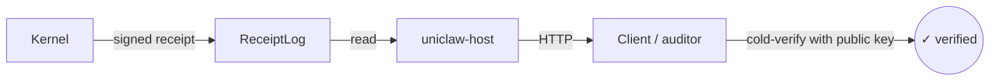

# Phase 2 Step 1 (G1) — Public-URL Receipt Hosting

> **Phase:** 2 — Public Service
> **PR:** _this PR_
> **Crate introduced:** `uniclaw-host`
> **Crate updated:** `uniclaw-receipt` (added `Digest::to_hex` / `from_hex`)

## What is this step?

This step turns `uniclaw://receipt/<hash>` into something an outsider can actually `curl`.

Before this step, every receipt was verifiable in theory — anyone with the public key could check the signature on a JSON file. But there was no place to **send people**. You had to email the JSON around. That's not how auditors work.

After this step, you can hand someone a URL — `https://your-host/receipts/<hex>` — and they can fetch the receipt with a browser, then verify it themselves with `uniclaw-verify` or any Ed25519-aware tool. No account. No login. No trust in the operator.

## Where does this fit in the whole Uniclaw?

This is the **first step of Phase 2**. Phase 1 built the trusted core that produces and stores receipts. Phase 2 makes those receipts **externally visible**.



`uniclaw-host` is purely a **read** consumer of the receipt log. It does not produce receipts and does not modify the chain. It does not even **re-verify** receipts on serving — that's deliberate. See "Why serve-as-stored" below.

This is also **the first crate in the workspace that depends on `std`**. The Phase 1 core is `no_std + alloc`. The host needs Tokio, axum, and a TCP listener — those require std. Keeping the trusted core no_std-friendly is unchanged: only `uniclaw-host` opts into std.

## What problem does it solve technically?

Four problems, one HTTP server.

### 1. "How does an external auditor fetch a receipt?"

Before: they couldn't, except by email. After: `curl https://your-host/receipts/<hex>`. The URL is the natural address — receipts are content-addressed by their BLAKE3 hash, so the URL **is** the canonical id.

### 2. "How do we keep the cache layer correct?"

Receipts are **immutable**. A given hash always produces the same body. So:

- Successful fetches ship `Cache-Control: public, max-age=31536000, immutable`. CDNs and browsers can cache forever.
- The `ETag` is a strong tag derived from the hash itself: `ETag: "<hex>"`. There is no other meaningful ETag.
- 404s explicitly opt out: `Cache-Control: no-store`. A receipt may exist later (e.g., it was just produced and not yet visible) and we don't want CDNs to remember the negative answer.
- 304 Not Modified is supported via `If-None-Match`. A repeat fetcher with the same hash gets a header-only response.

### 3. "How do we keep the trust model honest?"

By **not** running `crypto::verify` server-side on the served receipt.

This sounds counterintuitive ("why wouldn't the server verify?"), but it's the entire point: the value of cold verification is that the *client* checks, with the public key, **without trusting any third party**. If the server did the check and shipped a "✓ verified" header, downstream tooling might trust the header instead of the signature. We refuse to make that easier.

The receipt log already validates signatures at append time (Phase 1 step 7), so corrupted entries can't enter the log. The host then serves the receipt as it was stored. The client verifies. Three steps, three independent checks.

### 4. "How do we keep the trait surface ready for SQLite?"

The router is generic over `L: ReceiptLog + Send + Sync + 'static`:

```rust
pub fn router<L>(log: Arc<RwLock<L>>) -> axum::Router
where L: ReceiptLog + Send + Sync + 'static;
```

Today's `InMemoryReceiptLog` is the only impl. A future SQLite-backed log will plug in **without changes** to the host crate — the trait is the contract.

## How does it work in plain words?

The router has three routes:

| Method | Path                  | Behavior |
|--------|-----------------------|----------|
| GET    | `/`                   | Tiny HTML index pointing at the project's GitHub. |
| GET    | `/healthz`            | `{"ok": true, "count": <log_len>}` JSON. `Cache-Control: no-store`. |
| GET    | `/receipts/:hash_hex` | Receipt JSON if known, 404 if unknown, 400 if hex is malformed. |

CORS is permissive (`Access-Control-Allow-Origin: *`) — receipts are *meant* to be verifiable from any origin. There is no auth. There is nothing to authorize.

Internally:

```
1. Parse hex param into a 32-byte Digest.
   → bad hex: 400 with {"error":"invalid_hash", "detail": "..."}
2. Build the ETag (the hex itself, in quotes).
3. If `If-None-Match` matches the ETag: 304 with no body.
4. Acquire a read lock on the receipt log; clone the receipt out;
   release the lock.
   → unknown hash: 404 with {"error":"receipt_not_found", "hash": "..."}
5. 200 with the canonical receipt JSON, immutable cache headers,
   strong ETag.
```

The `tokio::sync::RwLock` is intentional: many readers can fetch in parallel; a future write path (ingest) won't block readers between writes.

## Why this design choice and not another?

- **Why axum + Tokio?** They're the idiomatic Rust web stack. Axum's router is small, layered with `tower`, and integrates cleanly with `tower-http` for CORS.
- **Why one route per endpoint instead of a trie of "everything under /api"?** Because there are only three endpoints. The route table reads as a spec.
- **Why a path-param hex string instead of a `:hash` extractor?** Because a typed extractor would couple the router to a specific hex parser. Keeping `:hash_hex` as `String` and parsing inside the handler keeps the parsing concern testable and the trait surface independent.
- **Why CORS permissive?** Because public-URL receipts are designed to be verifiable from any origin. Restricting CORS would only frustrate the legitimate use case while doing nothing to "secure" public-by-design data.
- **Why Cache-Control: immutable for 200?** Because content-addressed entries genuinely are immutable. CDN caching of receipts is a feature.
- **Why Cache-Control: no-store for 404?** Because the absence of a hash is not a permanent fact. We may produce that receipt later.

## What you can do with this step today

- Use the `uniclaw-host` library:

  ```rust,ignore
  use std::sync::Arc;
  use tokio::sync::RwLock;
  use uniclaw_host::router;
  use uniclaw_store::InMemoryReceiptLog;

  let log = Arc::new(RwLock::new(InMemoryReceiptLog::new(my_pubkey)));
  let app = router(log);

  let listener = tokio::net::TcpListener::bind("0.0.0.0:8787").await?;
  axum::serve(listener, app).await?;
  ```

- Or run the bundled binary, which loads `*.json` receipts from a directory:

  ```sh
  $ uniclaw-host --receipts-dir ./receipts --bind 127.0.0.1:8787
  uniclaw-host: serving 12 receipt(s) (issuer 9c1aef…) on http://127.0.0.1:8787

  $ curl -s http://127.0.0.1:8787/healthz
  {"ok":true,"count":12}

  $ curl -s http://127.0.0.1:8787/receipts/abc123…
  {"version":1,"body":{...},"issuer":"…","signature":"…"}

  $ curl -s http://127.0.0.1:8787/receipts/abc123… | uniclaw-verify --stdin --pubkey 9c1aef…
  ✓ verified
  ```

  The hand-off from `uniclaw-host` (server) to `uniclaw-verify` (cold verifier) is the whole user experience: serve the receipt; verify it with a separate tool.

## Performance baseline (release, in-process via tower::oneshot)

| Endpoint | Per request |
|---|---|
| `GET /receipts/<known>` (200, 100-entry log) | **11.30 µs** |
| `GET /receipts/<unknown>` (404) | **5.07 µs** |
| `GET /receipts/<known>` with matching `If-None-Match` (304) | **7.94 µs** |
| `GET /healthz` (1000-entry log) | **3.84 µs** |
| `GET /receipts/not-a-hash` (400) | **4.03 µs** |

The 200 path cost is dominated by `serde_json` encoding of the receipt body. Real-world network round-trip is dominated by OS + link + TLS, which is at least an order of magnitude greater than these numbers. The handler is not the bottleneck.

## What you cannot do yet

These ship later, on purpose:

- **TLS termination.** Run behind a reverse proxy (nginx, Caddy, Cloudflare). Adding TLS to the host crate would couple the binary to a specific TLS impl and complicate the simple case.
- **Rate limiting / abuse mitigation.** A future PR will add a `tower::Layer` for it.
- **Persistent receipts.** Today the receipt log is in-memory. The SQLite-backed `ReceiptLog` is the next planned follow-up; it slots in through the same trait without changes here.
- **HTML verifier UI.** A real client-side verification page is its own design. The current `/` page only points at the docs.

## In summary

Step 9 (the first step of Phase 2) makes Uniclaw's verifiability promise externally visible. Receipts are now reachable at a URL. The server is honest about what it serves: it does not re-verify and does not vouch. Verification stays the client's job — which is the whole point of cold-verifiable receipts. With this step shipped, Uniclaw has a public surface an auditor can use today.
