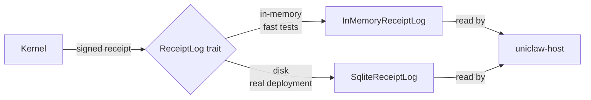

# Phase 2 Step 2 (G2) — SQLite-backed Receipt Store

> **Phase:** 2 — Public Service
> **PR:** _this PR_
> **Crate introduced:** `uniclaw-store-sqlite`
> **Crates updated:** `uniclaw-store` (trait now returns owned `Option<Receipt>`), `uniclaw-host` (gains a `--db <path>` flag)

## What is this step?

This step gives Uniclaw a **persistent receipt log**. Until now every receipt log lived in RAM — the moment a process restarted, every receipt was gone. With this step, you can point a kernel (or a host) at a SQLite file and the receipts survive across restarts, crashes, and reboots.

The on-disk log honors the same five-step append validation as the in-memory log. The same `verify_chain` walk. The same issuer pin. The only thing that changes is **where the receipts live** — and therefore whether they outlive the process that produced them.

## Where does this fit in the whole Uniclaw?

Without persistence, the public-URL host (G1, step 9) was a demo: the moment you kill the process, the receipts you served are gone. With persistence, the host becomes a real service. Auditors can cite a URL today and verify the same receipt next year.



The `ReceiptLog` trait is the contract. Both backends implement it. Code above the trait — the kernel, the host crate's router — does not change when you swap one for the other.

## What problem does it solve technically?

Three problems.

### 1. "How do receipts survive a restart?"

By writing them to a SQLite database. Each receipt becomes a row in a `receipts` table, keyed by `merkle_leaf.sequence` (primary key) with a UNIQUE index on the content hash for `get_by_id` lookups. The whole receipt — issuer, signature, body, chain link — is stored as canonical JSON in a `body_json` BLOB column. Reading a receipt back returns the **exact bytes** that were appended; cold verification works on the served bytes byte-for-byte.

```sql
CREATE TABLE receipts (
    sequence    INTEGER PRIMARY KEY,
    content_id  BLOB NOT NULL UNIQUE,
    issuer      BLOB NOT NULL,
    body_json   BLOB NOT NULL
);
CREATE TABLE meta (
    key   TEXT PRIMARY KEY,
    value BLOB NOT NULL
);
```

The `meta` table holds the **pinned issuer key**, the schema version, and the receipt format version. Reopening the database with a different issuer is refused. Reopening under a future schema version is refused. Both refusals happen at `open` time, before a single receipt is read.

### 2. "How do we keep the chain check fast?"

`SqliteReceiptLog` caches two things in memory: `cached_len` (the current count) and `cached_last_leaf_hash` (the most-recent receipt's leaf hash). Both are read from the database at `open` and updated on each successful append. This means **`len()` and append validation never touch the database** for the cached fields — saving a round-trip per append.

The cache is correct because v0 assumes a single writer per process. If we ever support multi-process writers (we don't plan to), we'd switch to per-append `SELECT MAX(sequence)` and accept the round-trip cost.

### 3. "How do we let `axum` share the log across async tasks?"

`rusqlite::Connection` is `!Sync` — it cannot be shared concurrently across threads. But axum's multi-thread runtime requires the State extractor to be `Sync`. Solution: wrap the connection in `std::sync::Mutex<Connection>` inside `SqliteReceiptLog`. Every method acquires the mutex briefly. The outer `tokio::sync::RwLock` (already used by `uniclaw-host`) serializes async access; the inner `std::Mutex` is uncontended in practice and exists purely to satisfy the `Sync` bound.

## Why we changed the `ReceiptLog` trait

There's one **breaking change** to the `ReceiptLog` trait this step ships:

```diff
- fn last(&self) -> Option<&Receipt>;
- fn get_by_sequence(&self, sequence: u64) -> Option<&Receipt>;
- fn get_by_id(&self, id: &Digest) -> Option<&Receipt>;
+ fn last(&self) -> Option<Receipt>;
+ fn get_by_sequence(&self, sequence: u64) -> Option<Receipt>;
+ fn get_by_id(&self, id: &Digest) -> Option<Receipt>;
```

**Why:** SQLite-backed implementations cannot return a borrowed `&Receipt`. The row arrives as a JSON blob from the database; the `Receipt` is materialized fresh on every call; there is nothing to borrow. The trait must accommodate that, or the SQLite impl is impossible.

**Blast radius:** small. The host crate already called `.cloned()` on the result. The in-memory impl just adds an inline `.cloned()`. Cost: ~1 µs per call on the in-memory path. Acceptable.

## How does it work in plain words?

```rust
use uniclaw_store_sqlite::SqliteReceiptLog;

// Open or create the log at this path, pinned to my Ed25519 public key.
let mut log = SqliteReceiptLog::open("./receipts.db", my_pubkey)?;

// Append receipts. Same five-step validation as InMemoryReceiptLog.
log.append(receipt)?;

// Look up by content hash — same trait, owned return.
if let Some(r) = log.get_by_id(&hash) {
    serve(r);
}

// Periodic integrity walk (Deep Sleep will call this).
log.verify_chain()?;
```

The `uniclaw-host` binary now accepts `--db <path>` to use SQLite mode:

```sh
# First run on a fresh DB — required to set the issuer.
$ UNICLAW_HOST_ISSUER=<64-char-hex> uniclaw-host --db ./receipts.db
uniclaw-host: backend=sqlite source=./receipts.db serving 0 receipt(s)
              (issuer 9c1aef…) on http://127.0.0.1:8787

# Subsequent runs: issuer is read from the DB; UNICLAW_HOST_ISSUER ignored.
$ uniclaw-host --db ./receipts.db
uniclaw-host: backend=sqlite source=./receipts.db serving 1247 receipt(s)
              (issuer 9c1aef…) on http://127.0.0.1:8787
```

The `--receipts-dir` mode (in-memory, load JSON files) still exists for tests and demos. The two modes are mutually exclusive on the command line.

## Why this design choice and not another?

- **Why `rusqlite` and not `sqlx`?** No compile-time SQL macros, no async overhead, smaller dependency tree. Our query set is six statements; we don't need a query builder.
- **Why `bundled` SQLite?** Static linking removes a system dependency. Cost is ~1 MB of binary size on `uniclaw-host` only — acceptable for a server binary; the verifier and core stay tiny.
- **Why store the whole receipt as a JSON blob, not column-shredded?** Two reasons. (1) Cold verification reads the receipt verbatim — bit-perfect storage matters. (2) The trait surface returns a `Receipt`; reconstituting from columns would risk drift if the canonical encoding ever changes. JSON blob is faithful.
- **Why WAL mode?** Concurrent reads + a single writer with no reader/writer blocking. Right shape for an audit log: you append from one place, read from many.
- **Why `synchronous = NORMAL` and not `FULL`?** NORMAL loses at most the last few milliseconds of writes on a power loss. The audit chain catches that on the next restart via `verify_chain` (the chain breaks at the unwritten leaf), which is exactly the failure mode receipts are designed to detect. FULL would double-fsync on every commit for protection we already have.
- **Why pin the issuer in the `meta` table, not derive it from the first receipt at open?** Explicit pin means a fresh DB needs an explicit issuer (`UNICLAW_HOST_ISSUER` env var) — operators cannot accidentally start a chain with a default key.
- **Why a `Mutex<Connection>` inside the struct?** Axum's `State` requires `Sync`. The mutex is the smallest change that makes `SqliteReceiptLog: Sync`. The outer tokio `RwLock` already serializes; the inner mutex is a Sync token, not a contention point.

## What you can do with this step today

- Run `uniclaw-host --db ./receipts.db` and have a real, restart-safe audit service.
- Use `SqliteReceiptLog` directly from any Rust program that needs persistent receipt storage.
- Reopen a database produced by an earlier process and continue appending — the chain validation uses the cached `last_leaf_hash` reloaded from disk.
- Run `verify_chain()` on a million-receipt database in roughly the same time as the in-memory baseline (per-receipt cost is ~62 µs, dominated by Ed25519).

## Performance baseline (release, x86_64 Linux)

| Operation | `InMemoryReceiptLog` | `SqliteReceiptLog` | Ratio |
|---|---|---|---|
| `append` | 85 µs | **370 µs** | 4.3× |
| `verify_chain` (per receipt) | 67 µs | **62 µs** | ~same |
| `get_by_id` | 0.37 µs | **12.35 µs** | 33× |

The ~4× append slowdown is the WAL write + fsync. Still 2,700 appends/sec — comfortably more than any kernel realistically produces. `verify_chain` is essentially the same because both backends are bottlenecked on Ed25519. `get_by_id` is much slower for SQLite, but 12 µs is invisible behind a network round-trip; for the public-URL host this does not matter.

## What you cannot do yet

- **Multi-process writers**: not supported. The cached `len` and `last_leaf_hash` would diverge. Single writer per process is the documented v0 assumption.
- **Schema migrations**: only schema version 1 exists. A future PR will add a migration framework when we need it.
- **Online compaction / snapshotting**: rely on standard SQLite tools (`VACUUM`, file copy under WAL checkpoint).
- **Encryption at rest**: deferred. If you need it, run on an encrypted filesystem or use SQLCipher in a follow-up step.

## In summary

Step 10 (the second step of Phase 2) makes the receipt log persistent. The trait stayed almost identical — one small tweak from `&Receipt` to `Receipt` — and a new crate plugs SQLite in behind the same surface. The host can now serve receipts that survive restarts, which is the prerequisite for any real `uniclaw.dev` deployment, and Deep Sleep's future integrity walks will finally be walking something meaningful.
