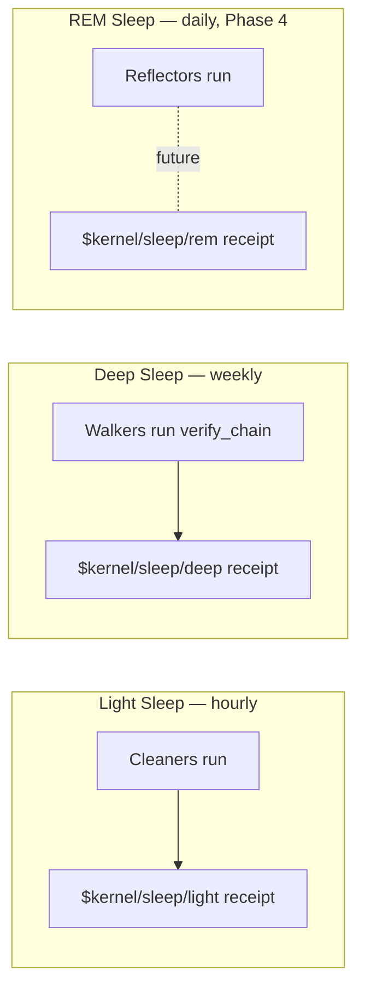

# Phase 2 Step 3 — Deep Sleep Integrity Walk

> **Phase:** 2 — Public Service
> **PR:** _this PR_
> **Crates updated:** `uniclaw-sleep` (adds Deep Sleep), `uniclaw-kernel` (new `KernelEvent::RunDeepSleep`)

## What is this step?

This step ships **Deep Sleep** — the third sleep stage in master plan §16.3, and the second of the three to actually ship code.

Deep Sleep is a **scheduled integrity walk**. Where Light Sleep tidies up *current* state, Deep Sleep re-examines the **history** of state to make sure nothing has been quietly tampered with after the fact. The canonical thing it walks is the receipt log: it calls `verify_chain()` and produces a signed audit receipt that records what it found.



After this step, **two of the three sleep stages ship**. The brand promise — *"Uniclaw is the first agent runtime that sleeps"* (master plan §16.3.4) — is materially closer to true. REM Sleep is left for Phase 4 because it needs subsystems that aren't built yet (provenance graph, federated memory).

## Where does this fit in the whole Uniclaw?

The sleep architecture is symmetric. Light Sleep wraps cleaners (mutating, GC-style passes); Deep Sleep wraps walkers (read-only, integrity-checking passes). Both produce a typed report that the kernel turns into a signed receipt.

```
Scheduler (cron, systemd, your code)
      |
      v
run_deep_sleep(walkers) -> DeepSleepReport
      |
      v
KernelEvent::RunDeepSleep -> Kernel::handle_deep_sleep
      |
      v
$kernel/sleep/deep receipt, chained, signed
```

Deep Sleep *only became meaningful* after [step 10 (G2)](10-sqlite-receipt-store.md) shipped persistent storage. Before SQLite-backed logs existed, an integrity walk could only check what the current process had just minted — there was no history to re-walk across runs. With persistence, a Deep Sleep pass run today can detect tampering of receipts written months ago.

## What problem does it solve technically?

Three problems, one trait + one event.

### 1. "How do we detect tampering of stored audit data?"

The receipt log already validates *appends*: any receipt that doesn't extend the chain is refused. But what about *after* an append? An attacker with file-system access could edit a `body_json` blob in SQLite and bypass append's checks entirely. The signature would no longer match the body, and the chain would be broken — but only if someone *re-checks*.

Deep Sleep is that re-check. The built-in `ReceiptLogWalker` calls `ReceiptLog::verify_chain()`, which re-walks every receipt and re-runs all the invariants from append validation. Tampering is detected and recorded in the resulting receipt — which is itself signed and chained, so the auditor knows *when* the integrity walk ran and what it found.

### 2. "How does the trait surface stay extensible?"

Future Deep Sleep tasks (per master plan §16.3.3) include walking the provenance graph, archiving cold session data, and garbage-collecting unconfirmed REM hypotheses. None of those subsystems exist yet, but the trait shape that ships today is designed for them:

```rust
pub trait Walkable {
    fn name(&self) -> &str;
    fn walk(&self) -> Result<WalkReport, WalkError>;
}
```

When Phase 4 lands the provenance graph, a `ProvenanceGraphWalker` implements `Walkable` and slots in — no kernel change needed. Same for archival workers, hypothesis GC, etc.

### 3. "How is this orchestrated?"

A free function, mirroring Light Sleep:

```rust
pub fn run_deep_sleep(walkers: &mut [&mut dyn Walkable]) -> DeepSleepReport;
```

Best-effort: a failing walker (including one that *detected* tampering) is **recorded**, not propagated. The next walker still runs. The kernel mints a single receipt for the whole pass with one `ProvenanceEdge` per walker, so an auditor sees at a glance which subsystems passed and which found problems.

## How does it work in plain words?

```rust
use std::sync::Arc;
use uniclaw_kernel::{Kernel, KernelEvent, ReceiptLogWalker, run_deep_sleep};
use uniclaw_store_sqlite::SqliteReceiptLog;

// Open the persistent receipt log this kernel produces into.
let audit = SqliteReceiptLog::open("./receipts.db", my_pubkey)?;

// Register one walker over the audit log. Future passes register more.
let mut walker = ReceiptLogWalker::new("audit/main", &audit);
let report = run_deep_sleep(&mut [&mut walker]);

// Audit: the walker found 12,481 receipts; verify_chain passed.
println!("walked {} items, {} failures", report.total_items_walked(), report.failed_count());

// Mint the audit receipt that proves the walk ran.
let outcome = kernel.handle(KernelEvent::run_deep_sleep(report))?;

// outcome.kind == OutcomeKind::DeepSleepCompleted { failed_walkers: 0 }
// outcome.receipt is a signed `$kernel/sleep/deep` receipt with one
// provenance edge: walker:audit/main → items=12481 bytes=0
```

The receipt looks like (action target trimmed):

```json
{
  "action": {
    "kind":   "$kernel/sleep/deep",
    "target": "walkers=1 items=12481 bytes=0 failed=0"
  },
  "decision": "allowed",
  "provenance": [
    {
      "from": "walker:audit/main",
      "to":   "items=12481 bytes=0",
      "kind": "deep_sleep_pass"
    }
  ]
}
```

If `verify_chain` had failed, the edge would be `deep_sleep_failure` with the error message in `to`.

## Why this design choice and not another?

- **Why a separate `Walkable` trait, not just reuse `Cleanable`?** Cleaners take `&mut self` because they mutate state (delete rows, vacuum tables). Walkers take `&self` because integrity walks are read-only by definition. Conflating them would let a "cleaner" silently rewrite the audit chain — a security smell. The two traits are deliberately separate.
- **Why a built-in `ReceiptLogWalker` and not "users supply their own"?** Because every Uniclaw deployment will want to walk the receipt log, and the wrapper is twelve lines of code. Shipping it removes a foot-gun. Other walkers (provenance, memory) live in their own crates when those subsystems land.
- **Why mint a receipt for an empty pass (no walkers registered)?** Same reason as Light Sleep: a quiet receipt chain with no `$kernel/sleep/deep` entries would mean the schedule isn't firing, which is itself the alarm-worthy condition.
- **Why `&dyn Walkable` and not a registry?** The scheduler that *runs* Deep Sleep is the right place to know which walkers to invoke. Different deployments register different walkers. No global registry; the caller passes the slice.
- **Why does a walker that detects tampering return `Err`, not `Ok` with a flag?** Because tampering is the failure mode, and the walker's contract is "tell me if anything is wrong." `Err` is the natural shape; the kernel records it as a `deep_sleep_failure` provenance edge so auditors see it.

## What you can do with this step today

- Schedule a `run_deep_sleep` pass on a weekly cron / systemd timer.
- Register walkers for whatever subsystems your deployment owns (today: a `ReceiptLogWalker` over your `InMemoryReceiptLog` or `SqliteReceiptLog`).
- Hand the resulting `DeepSleepReport` to the kernel via `KernelEvent::run_deep_sleep`.
- Inspect the resulting receipt to see what was checked. If `failed_walkers > 0`, page yourself.
- Build downstream dashboards (or your own tooling) on top of `$kernel/sleep/deep` receipts queried by content hash from the public-URL host.

## Performance baseline (release, x86_64 Linux)

`ReceiptLogWalker` calls `verify_chain`, which is dominated by per-receipt Ed25519 verify (~52 µs warm).

| Chain length | Per-pass | Per-receipt |
|---|---|---|
| 100 | 5.0 ms | 50.1 µs |
| 1,000 | 54.1 ms | 54.1 µs |
| 10,000 | 530 ms | 53.0 µs |

A million-receipt chain takes ~52 seconds — comfortable for weekly Deep Sleep. The walk is single-threaded; future steps could parallelize over independent receipts if a deployment grows past the comfortable range.

## What you cannot do yet

These are the parts of master plan §16.3.3 that **don't ship today** because the underlying subsystems aren't built:

- **Promote frequently-recalled facts** to long-term identity memory (blocked on Phase 4 long-term memory store).
- **Archive cold session data** to compressed artifact storage (blocked on Phase 4 session store).
- **Garbage-collect unconfirmed REM hypotheses** (blocked on REM Sleep, Phase 4).
- **Walk the provenance graph** (blocked on Phase 4 provenance graph).

The trait surface is shaped for all of these. When Phase 4 ships those subsystems, each one gets a `Walkable` impl and the next Deep Sleep pass starts walking it — no kernel changes required.

## In summary

Step 11 makes the Merkle audit chain a **walked** chain — not just an *appended* one. With persistent storage from G2 already on `main`, Deep Sleep can detect after-the-fact tampering across process restarts. The trait shape is symmetric to Light Sleep so the architecture stays uniform; the kernel learns one new event variant; the receipt format is unchanged. Two of three sleep stages now ship.
